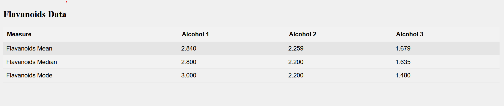

# Wine Data Analytics Project

## Data is grouped based on Class (Alcohol) properties. Mean, Meadian & Mode is calculated for the grouped data's below mentioned properties

### Flavaniods Data

### Gamma Data

# Getting Started

## Clone the repo
