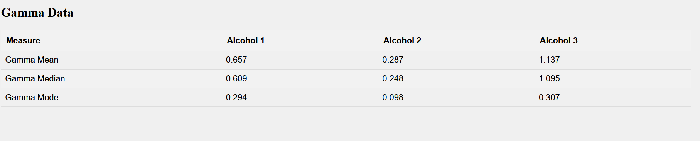

# Wine Data Analytics Project

[Github Repository](https://github.com/Yash-Yadav-git/data-visualization)

## Data is grouped based on Class (Alcohol) properties. Mean, Meadian & Mode is calculated for the grouped data's below mentioned properties

### Flavaniods Data

### Gamma Data

# Getting Started

To get started follow these steps

## Clone the repo
 
To clone the project repository to your local machine, use the following command:

git clone https://github.com/Yash-Yadav-git/data-visualization.git

## Installation

### Prerequiste

[Node.js](https://nodejs.org/) installed

[yarn] (https://classic.yarnpkg.com/lang/en/docs/install/#windows-stable) package manager installed

### Install Dependencies

~~~bash
yarn install
~~~

## Run/Start project

~~~bash
yarn start
~~~

## Build Project
~~~bash
yarn build
~~~
